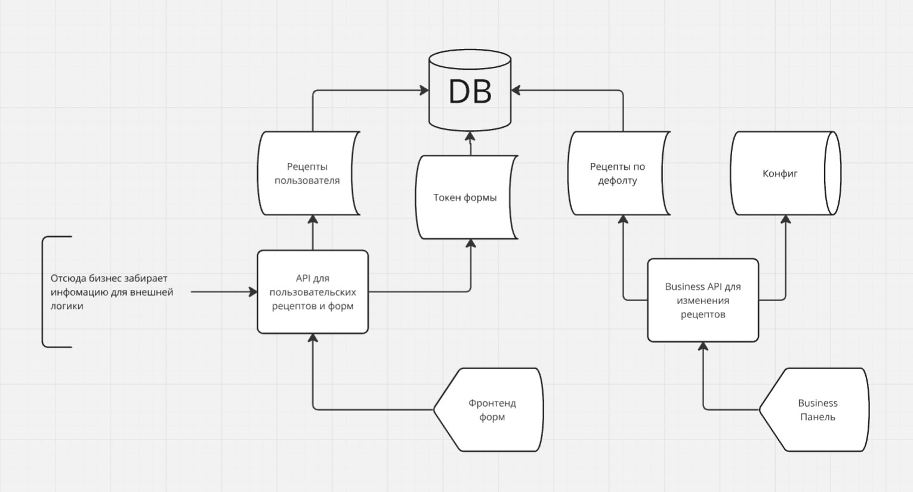

# Balance

Серверное приложение, предоставляющее услуги автоматического изменения рецептов под предпочтения клиентов. Подойдёт под
любой бизнес, изготавливающий еду или напитки не из заготовок.

## Что мы предоставляем

### Что получит клиент?

После каждой покупки пользователь получает форму из небольшого числа вопросов. Каждый вопрос - шкала, насколько гость
предпочёл бы ослабить или усилить некоторую вкусовую характеристику. После заполнения формы рецепт изменяется под него
автоматически, и со следующим продуктом он получит адаптированный под него вкус.

### Что получает бизнес?

Форму для редактирования вышеуказанного опросника, отдельную для каждого продукта. Менеджер формы указывает коэфициенты,
насколько каждый из параметров во время приготовление влияет на заданные вкусовые характеристики.

## Как это работает?

Мы исходим из предположения, что вкусовые предпочтения клиента - унимодальная функция над пространством из отдельных
вкусовых характеристик(сладость, соленость, горечь, кислотность, температура, концентрированность вкуса и т. д.). Для
поиска максимального значения таких функций идеально подходит градиентный спуск. Но что же такое градиент для
предпочтений клиента? То насклолько он бы изменил каждую вкусовую характеристику, то есть результат собранного нами
опросника.

## Формат конфигурации рецепта

JSON-файл содержит:
Поле name, содержащее название рецепта
Поле tastes, содержащее вкусовые характеристики
Поле default_measures с полями ингридиентов и их дефолтных значений.
Поле change_coeficients с полями ингридиентов, содержащих поля вкусовых характеристик и соответствующих им коэфициентов.

## Формат опросника

JSON-файл содержит:
поле changes - словарь, содержащий поля вкусов, которым соответствуют коефициенты изменения от -0.1 до 0.1

## Функциональные требования

1. Добавление рецепта напитка пользователем
2. Создание формы опроса пользователя для заказчика

## Архитектура

### Взаимодействие компонентов:

- Клиент отправляет запросы через Frontend на API
- API обрабатывает запросы и взаимодействует с Бизнес-логикой
- Бизнес-логика выполняет необходимые операции и взаимодействует с Базой данных через API
- Сервер возвращает данные, которые передаются обратно через API на Frontend и отображаются клиенту
  